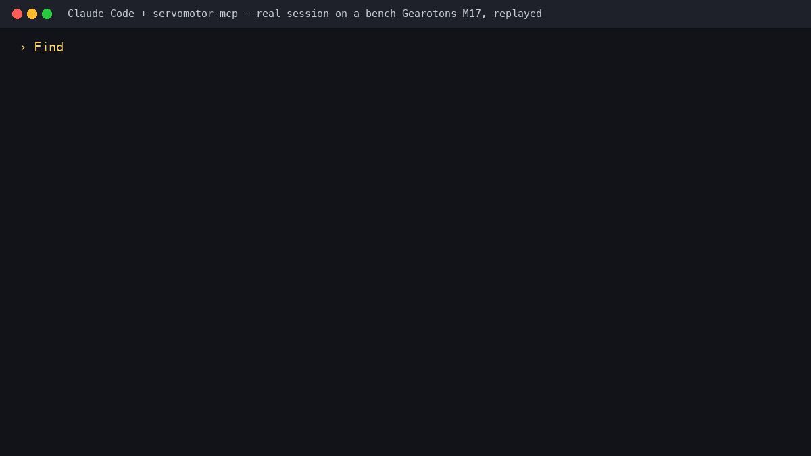

# servomotor-mcp

<!-- mcp-name: io.github.Gearotons/servomotor-mcp -->

**Drive open-source [Gearotons M17](https://gearotons.com) servomotors from natural language.**

An [MCP](https://modelcontextprotocol.io) server that exposes the M17 — a NEMA-17
integrated, closed-loop, RS-485 servomotor — to Claude Desktop, Claude Code, or any MCP
client. Control real motors by just *asking*:

> "Find my motors and rotate the one on the bench two full turns, slowly."

Nothing is hardcoded: the server **discovers your serial ports**, **auto-detects the
motors on the bus** (the firmware's "Detect devices" command), and exposes the **entire
firmware command set** — every command in the `servomotor` library's catalog becomes an
MCP tool automatically (48 commands as of library 0.10.0), plus a few high-level tools
for everyday moves. It ships with a **mock backend**, so you can try the whole thing with
**no hardware**.

<p align="center">
  
</p>
<p align="center"><a href="https://github.com/Gearotons/servomotor-mcp/releases/download/v0.3.1/M17-claude-code-demo.mp4">▶ 50-second video: the real motor and this session side by side</a> — recorded 2026-09-09 on a bench M17; every line above is from the session log.</p>

<p align="center">Step-by-step tutorial (boxed motor to "talk to it" in about twenty minutes): <a href="https://www.hackster.io/gearotons/talk-to-a-servomotor-from-claude-code-20-min-20-motor-2f6bb9">Talk to a servomotor from Claude Code</a> on Hackster.</p>

> The first servomotor with an official MCP server. Open hardware, open firmware, open
> software — and now an open, AI-native control interface.

---

## Quickstart (no hardware, ~2 minutes)

```bash
# Run the server directly with uv (recommended):
uvx --from servomotor-mcp servomotor-mcp

# or install it:
pip install servomotor-mcp
servomotor-mcp
```

Then add it to **Claude Desktop** — copy the block from
[`examples/claude_desktop_config.json`](examples/claude_desktop_config.json) into your
`claude_desktop_config.json`, restart Claude Desktop, and ask:
*"What serial ports do you see? Connect and find my motors."*
See [`examples/demo_prompts.md`](examples/demo_prompts.md) for a scripted demo.

## Drive real motors

Plug an M17 (or a daisy-chain of them) into a USB↔RS-485 adapter and install the
`[serial]` extra — that's it, no configuration:

```bash
pip install 'servomotor-mcp[serial]'   # pulls in the Gearotons servomotor library
servomotor-mcp
```

With the `servomotor` library installed the server uses the real serial backend
automatically. In a session, the model then:

1. `list_serial_ports` — enumerates the machine's ports (macOS `/dev/cu.*`,
   Windows `COM*`, Linux `/dev/ttyUSB*`), flagging USB serial adapters;
2. `connect` — opens the port you (or it) picked, at 230400 baud;
3. auto-detects every motor on that bus (unique ID + alias) — no address maps to write;
4. drives them. Tell it in plain English which adapter to use if you have several.

## Tools

High-level (discovery + everyday motion):

| Tool | What it does |
|---|---|
| `list_serial_ports` | Enumerate serial ports with USB metadata (call first). |
| `connect` / `disconnect` | Open a port and auto-detect the motors on that bus. |
| `detect_devices` | Re-scan the bus (reboots the motors on it). |
| `list_motors` | Detected motors with live position/voltage/temperature/status. |
| `move_to` / `move_relative` | Absolute / relative moves in degrees; waits for completion. |
| `stop` | Emergency-stop one or all motors. |
| `get_motor_status` | One motor's snapshot, fatal errors decoded to plain English. |
| `run_sequence` | Choreographed steps ("draw a square"), incl. raw command steps. |

Plus **one tool per firmware command**, generated from the library's command catalog:
`enable_mosfets`, `go_to_position`, `move_with_velocity`, `move_with_acceleration`,
`multimove`, `homing`, `zero_position`, `get_position`, `get_temperature`,
`set_device_alias`, `set_pid_constants`, `system_reset`, `vibrate`, `ping`, … — anything
the motor can do, the model can do. Motors are addressed by their alias number, their
16-hex-digit unique ID, or `"all"` (broadcast). Values are in friendly units (degrees,
seconds, degrees/s, volts, °C); the server converts to firmware units.

## How it works

```
natural language → Claude → MCP tool calls → this server → RS-485 → M17 motors
```

The server is a thin layer over the Gearotons `servomotor` Python library. The library is
data-driven — `motor_commands.json` defines every firmware command — and the server turns
that same catalog into MCP tools, so new library commands appear automatically. Tool calls
are forwarded straight to the hardware — no software clamping; full multi-turn travel, any
speed. The motor's own firmware protections (over-current / over-voltage /
over-temperature) still apply. The same tools run against the mock backend
(`GEAROTONS_MOTOR_BACKEND=mock`) for development and CI.

Environment variables (all optional):

- `GEAROTONS_MOTOR_BACKEND` — `auto` (default: serial when the `servomotor` library is
  installed, else mock), `serial`, or `mock`.
- `GEAROTONS_SERIAL_PORT` — default port for `connect` when the model doesn't pass one.
- `GEAROTONS_DEFAULT_SPEED_DPS` — default speed for `move_to`/`move_relative` (180).

## Develop / test

```bash
pip install -e '.[dev]'
GEAROTONS_MOTOR_BACKEND=mock pytest     # catalog + mock-bus + server-tool tests
```

`hardware_tests/` contains scripts that exercise the real serial path end to end
(port sweep, full command suite, stdio MCP session) against a bench motor.

## Status

- ✅ Full firmware command surface (48 commands), serial-port discovery, bus
  auto-detection — **verified on a physical M17** (fw 0.15.3.0) over a real stdio MCP
  session and via `uvx`, on all four test adapters (motor found only where it truly is).
- ✅ Mock backend + 39 unit tests, no hardware needed.
- ✅ Cross-platform port handling (macOS / Windows / Linux) via pyserial enumeration.

## License

MIT. Hardware, firmware, and software for the M17 are open-source —
see [github.com/tomrodinger/servomotor](https://github.com/tomrodinger/servomotor).
